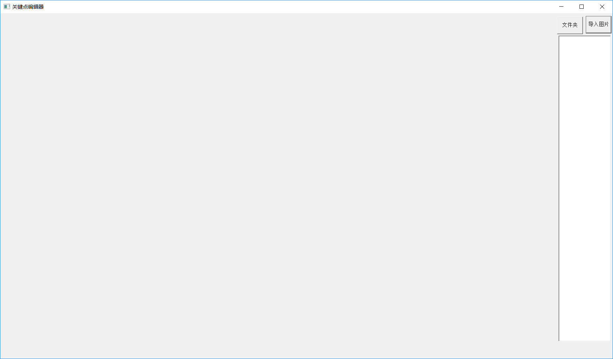
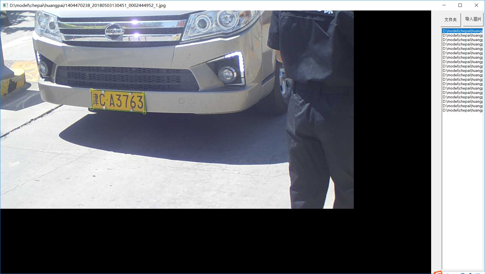
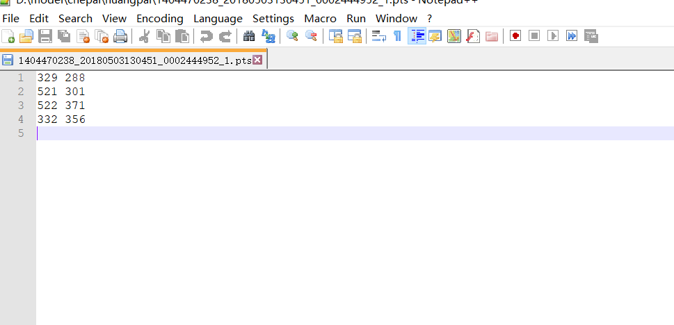
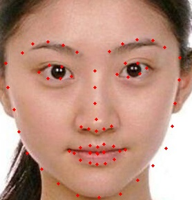

## HyperLabelImg

目前github上已经有几个较为成熟的图像标注工具，例如labelimg等，这类标注工具支持类型相对单一，更多的是支持规则图形的标注。我们跟其他图像算法爱好者私下沟通中，大家都遇到类似的问题，好多人也自己开发了相应的工具，存在重复造轮子的局面，鉴于此，经过与开发者海豚嘎嘎大神的商讨，我们决定开源这个标注工具。源码全部开源，支持人脸关键点，不规则四边形、多边形的标注，欢迎使用。

#### 编译

该工程基于vs2015，直接打开工程，配置路径下提供的opencv即可编译成功。

#### 使用

##### 1.双击打开程序，如下所示：

##### 2.点击右上角导入文件夹或者单张图片，通过调整图片位置与四个标注点的位置，确定待标注物体坐标：

##### 3.标注完毕，按下CTRL+S保存标注信息，标注信息与标注文件命名相同，后缀为.txt，存在同一目录：

##### 4.针对人脸关键点标注，可以参考我们内部的代码，自己修改，效果如图所示：

#### 致谢

海豚嘎嘎
